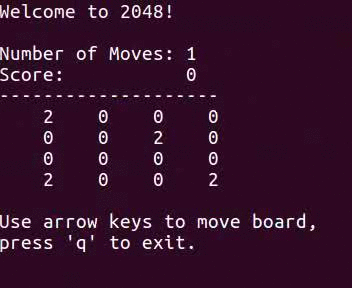

2048cl
======

Simple command line implementation of the game
[2048](https://github.com/gabrielecirulli/2048). Written in C++, interface based
on ncurses.

To build use [ninja](https://ninja-build.org/).
